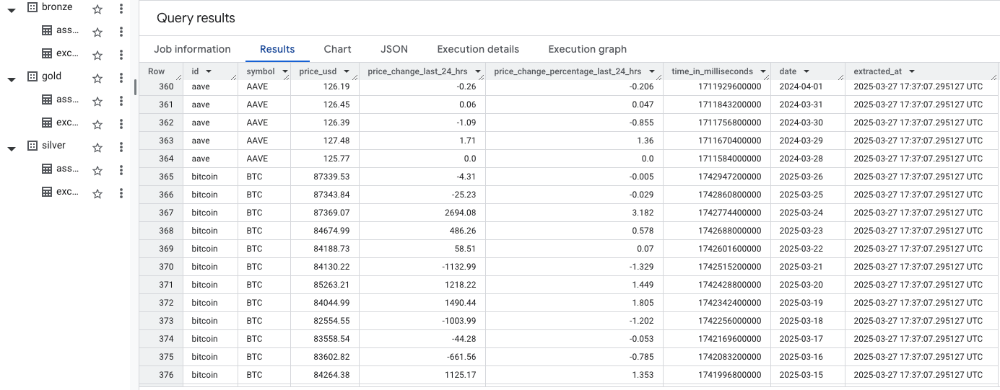
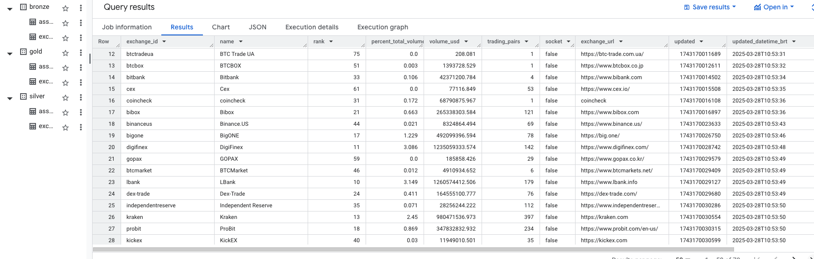
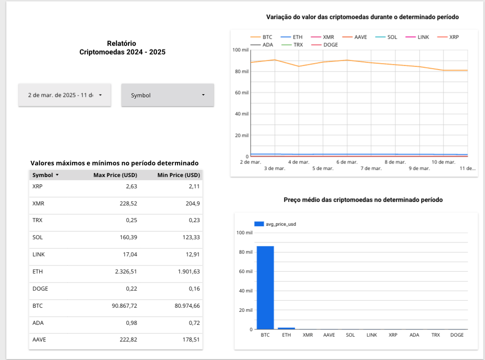
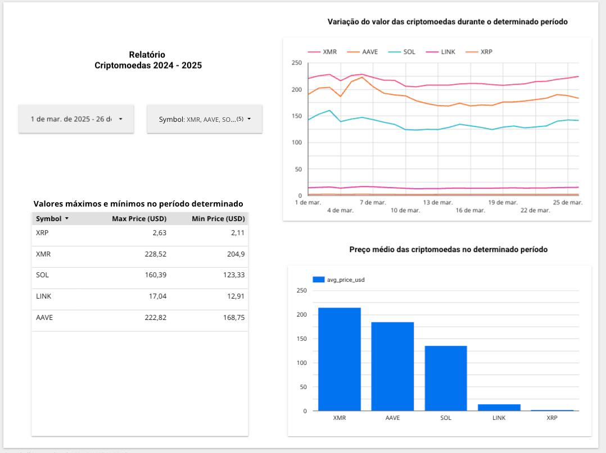
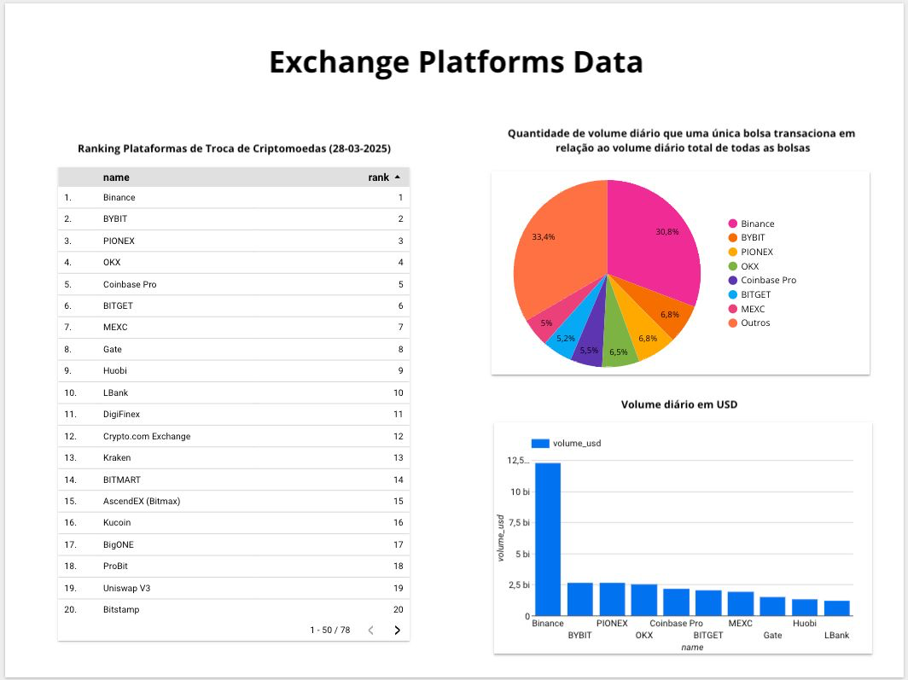

# Pipeline Criptomoedas
## Sobre
Este projeto tem como objetivo a construção de um pipeline de dados para coletar e analisar informações de diversas criptomoedas por meio da CoinCap API 2.0. Os dados extraídos são processados e armazenados em um Data Warehouse, permitindo a aplicação de transformações para enriquecer as informações. Como produto final, foi desenvolvido um dashboard interativo no Looker Studio, facilitando a visualização e geração de insights a partir dos dados coletados.

## Tecnologias e ferramentas utilizadas
- Python 3.13.1
- Big Query(Google Cloud Platform)
- Linguagem SQL
- Looker Studio
- API "CoinCap API 2.0" 

## Bibliotecas Python Utilizadas
- python-dotenv
- requests
- pandas-gbq
- pandas
- google-cloud-bigquery
- google-auth
- datetime
- os

## Como baixar as dependências python necessárias? 
Para instalar as dependências necessárias para o script python, basta ter o arquivo "requirements.txt" no diretório local que será utilizado para o desenvolvimento do projeto. Após isso, basta abrir o terminal/prompt de comando no diretório em questão e executar o seguinte comando: 

> <strong>"pip install -r requirements.txt"</strong>

Isso irá fazer com que todas as bibliotecas necessárias para o funcionamento do projeto sejam instaladas em sua máquina ou ambiente virtual.

## Como executar o script python? 
Para executar os scripts python, basta abrir o terminal na pasta do projeto e executar o seguinte comando: 

>"python nome_do_arquivo.py"

## Construção 
### Consultando a API
O primeiro passo para iniciar o pipeline de dados foi consultar e analisar a <a href="https://docs.coincap.io/#ee30bea9-bb6b-469d-958a-d3e35d442d7a" target="_blank">documentação oficial da CoinCap API 2.0</a> para compreender sua utilização de forma adequada.

Após essa análise, decidi coletar dados históricos de diversas criptomoedas disponíveis, utilizando o método "Assets", além de utilizar o método "Exchange" para coletar dados de todas as plataformas de trocas de criptomoedas disponíveis via API. Esses métodos forneceram dados valiosos com grande potencial para a geração de insights e o cálculo de novas métricas.

Além disso, foi necessário criar uma chave de API para permitir a realização das requisições via script Python. A documentação forneceu um guia simples e prático para esse processo.

### Scripts Python
Os scripts Python foram desenvolvidos com foco na flexibilidade, garantindo fácil adaptação ao ambiente de execução. Eles podem ser utilizados tanto como uma função inline no Google Cloud Run quanto como uma DAG no Airflow.

Os scripts foram divididos em duas partes, cada uma com um objetivo específico:

- Um script responsável pela extração dos dados e pelo carregamento no banco de dados/data warehouse.

- Outro script para executar consultas SQL de transformação de dados, através de uma conexão com o Google BigQuery.

### Google Big Query 
Para simular a manipulação de grandes volumes de dados, optei por utilizar o Google BigQuery como banco de dados/data warehouse para armazenar os dados extraídos da API. A organização dos dados segue a arquitetura em camadas (medalhão), estruturando o data warehouse em três níveis(datasets):

- Camada Bronze: Armazena os dados brutos, exatamente como são extraídos da API, sem qualquer tipo de transformação.

- Camada Silver: Contém os dados já limpos, transformados e padronizados a partir da camada Bronze.

- Camada Gold: Armazena os dados enriquecidos com regras de negócio aplicadas, agregando informações e gerando novos insights.

#### Datasets/Camadas e Tabelas

### Looker Studio 
Como produto final do pipeline de dados, foram desenvolvido dashboards interativos no Google Looker Studio para cada tabela final, permitindo uma análise visual dos dados coletados e facilitando a geração de insights sobre o mercado de criptomoedas.

Os dashboards apresentam diferentes componentes visuais para interpretar as métricas extraídas:

#### Dashboard com dados da tabela "assets_history" camada gold

- Tabela de valores máximos e mínimos: Exibe os preços mais altos e mais baixos alcançados por cada criptomoeda no período selecionado, permitindo uma análise da volatilidade dos ativos.

- Gráfico de variação dos preços: Representa a flutuação dos valores das criptomoedas ao longo do tempo, ajudando a identificar tendências e momentos de alta ou queda no mercado.

- Gráfico do preço médio: Mostra a média de preços das criptomoedas no período analisado, fornecendo um panorama geral sobre a valorização relativa de cada ativo.

Esses elementos permitem uma compreensão mais clara do comportamento do mercado, auxiliando na identificação de padrões, na comparação entre diferentes criptomoedas e na tomada de decisões baseadas em dados.

#### Dashboard com dados da tabela "exchange_platforms" camada gold

- Tabela Ranking das Plataformas de Troca de Criptomoedas: Mostra as principais exchanges ordenadas por relevância. Sendo assim, importante para identificar quais plataformas dominam o mercado e possuem maior liquidez.

- Gráfico de Pizza: Exibe a participação de cada exchange no volume total de transações. Essencial para entender a concentração de mercado e a competitividade entre as plataformas.

- Gráfico de Barras: Demonstra o volume diário de transações das exchanges em dólares. De modo a indica quais plataformas movimentam mais dinheiro, auxiliando na análise de liquidez e estabilidade do mercado.

